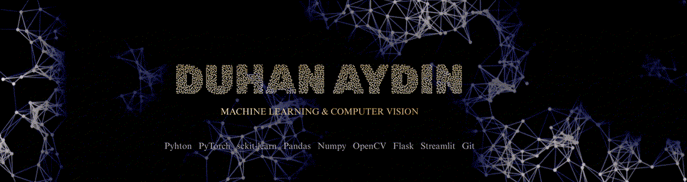

<p align="center">
  
</p>

---

<h1 align="center"></h1>
<h3 align="center">Junior Machine Learning & Computer Vision Engineer</h3>

<p align="center">
  <b>First, understand the system. Then, train the model.</b>
</p>

<p align="center">
  I build machine learning systems around experimentation, failure analysis, and deployment-ready thinking.
</p>

---

<pre>
&gt; whoami

Name        : Duhan Aydın
Role        : Junior ML / Computer Vision Engineer
Focus       : Model behavior • Feature engineering • Computer vision • End-to-end ML systems
Approach    : Understand → Strategize → Experiment → Analyze → Improve
Location    : Türkiye / Eskişehir
Status      : Open to work
</pre>

---

## ◇ About Me

<table>
<tr>
<td width="56%" valign="top">

I approach machine learning as a system design problem before I treat it as a modeling task.

Before writing code, I try to understand what the data really represents, where the signal comes from, what assumptions I am making, and why a model might fail. That mindset shapes how I work across preprocessing, feature engineering, model selection, evaluation, and deployment.

I do not like jumping into a single model too early. I prefer building multiple strategies, testing them one by one, comparing their behavior, and improving the system based on actual observations instead of guesses.

My main interest is not only improving accuracy, but understanding failure cases, edge conditions, class-level performance, and whether the pipeline can be explained, debugged, and iterated on.

**In practice, I care about:**
- data-driven feature engineering
- comparing multiple modeling approaches
- analyzing weak classes and failure cases
- building end-to-end systems, not just notebooks

</td>
<td width="44%" valign="top">

```python
class MLEngineer:
    def __init__(self):
        self.mindset = {
            "problem_first": True,
            "single_model_bias": False,
            "explainability_matters": True,
            "deployment_ready": True
        }

        self.focus = [
            "Data inspection & preprocessing",
            "Domain-driven feature engineering",
            "Model comparison & evaluation",
            "Failure-case analysis",
            "Confidence / margin analysis",
            "Explainability",
            "Deployment"
        ]

    def approach(self):
        return [
            "Understand the system",
            "Design multiple strategies",
            "Experiment systematically",
            "Analyze model behavior",
            "Iterate with purpose"
        ]

    def philosophy(self):
        return "Accuracy is useful. Understanding is essential."
```

</td>
</tr>
</table>

---

---
## ◇ Featured Projects

<table>
<tr>
<td width="33%" valign="top">

### 🌿 Plant Disease Classification  
**Research-oriented Deep Learning project**

Built an experiment-driven plant disease classification project using the PlantVillage dataset.

**Highlights**
- Compared CNN, SVM, KNN, hybrid models, and transfer learning
- Focused on weak-class recall instead of only overall accuracy
- Performed class-wise error analysis and margin analysis
- Built a modular inference structure for multiple backends

<br><br><br>

**Stack**  
PyTorch • OpenCV • Flask • Streamlit

</td>

<td width="33%" valign="top">

### 🚗 Traffic Accident Prediction  
**End-to-end ML pipeline**

Developed a T+1 accident risk prediction system using weather data and synthetic hourly labels.

**Highlights**
- Designed a controlled synthetic labeling strategy
- Applied domain-driven feature engineering with non-linear weather risk behavior
- Compared XGBoost, Random Forest, and Neural Networks across iterative training versions
- Performed SHAP, PDP, and feature importance analysis
- Integrated the system with Flask API and dashboards

<br>

**Stack**  
Python • scikit-learn • XGBoost • Flask

</td>

<td width="33%" valign="top">

### 🏃 Activizer  
**Graduation Project – Real-time CV system**

Worked on the computer vision side of a motion training system.

**Highlights**
- Evaluated MediaPipe, MoveNet, and YOLO-based approaches
- Built ROI-based motion trigger logic for exercise step progression
- Improved detection reliability through iterative redesign
- Contributed to timing analysis and validation scenarios

<br><br><br><br>

**Stack**  
OpenCV • YOLO • MediaPipe • Raspberry Pi 5

</td>
</tr>
</table>
## ◇ Tech Stack

### Core Languages
<p align="center">
  
  &nbsp;
  
  &nbsp;
  
</p>

---

### Machine Learning & Deep Learning
<p align="center">
  
  &nbsp;
  
  &nbsp;
  
</p>

<p align="center">
  <b>Model Experience:</b><br>
  Logistic Regression • Random Forest • XGBoost • Neural Networks
</p>

---

### Computer Vision
<p align="center">
  
  &nbsp;
  
  &nbsp;
  
  &nbsp;
  
</p>

---

### Deployment & Tools
<p align="center">
  
  &nbsp;
  
  &nbsp;
  
</p>

## ◇ Key Repositories

- [Plant Disease Study](https://github.com/CodeByDuhan/plant-disease-study)
- [Traffic Accident Prediction](https://github.com/CodeByDuhan/traffic-accident-prediction)

---

## ◇ Mindset

- I do not optimize only for accuracy
- I focus on model behavior and edge cases
- I prefer experimentation over assumptions
- I build systems that can be explained, debugged, and improved

